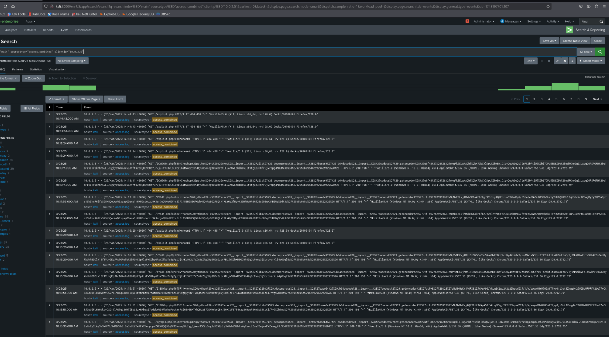
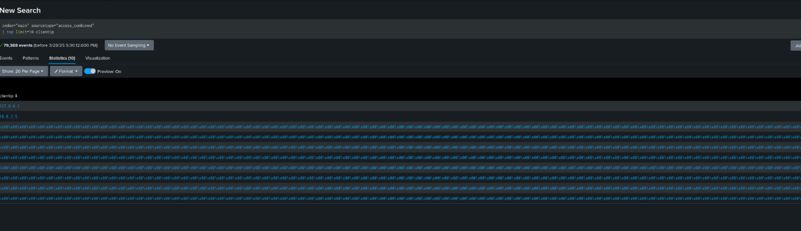
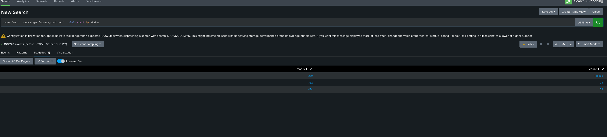
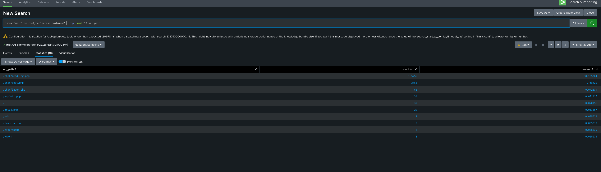

# 📊 Phase 2: SIEM Dashboard Analysis

## 🔧 SIEM Setup

In this phase, we integrated logs from both the **victim** and **attacker** environments into **Splunk**, our chosen SIEM tool. This step enables central analysis, threat detection, and deeper insight into attacker behavior.

> 📸 *Screenshot A: Uploading system-journal.log into Splunk (Attacker logs)*  


### ✅ Logs Integrated: ("logs from both environments") 
- **Victim (Metasploitable3)**: Apache access logs (`access.log`)
- **Attacker (Kali Linux)**: System journal logs (`system-journal.log`)


-
> 📸 *Screenshot C: Uploading `system-journal.log` into Splunk (Attacker logs)*


---

### 📊 Log

Once both log files were uploaded, we used Splunk's **Search & Reporting** app to:


> 📸 *Screenshot B: Splunk main dashboard after logging in successfully*


> 📸 *Screenshot D: Querying `system-journal.log` inside Splunk*


### Now Lets transfer the "access.log" to kali and upload it to splunk 
> 📸 *Screenshot E: Setting up local Python server on Metasploitable3 to share the log file*


> 📸 *Screenshot F: SCP command on Kali to download the log from the victim*


> 📸 *Screenshot G: Log file successfully transferred to Kali*


> 📸 *Screenshot H: Uploading Apache `access.log` into Splunk*

>
> ## 🧠 Attack Analysis & Pattern Detection

In this section, we deep-dive into Splunk’s powerful analytics capabilities to uncover meaningful patterns that shed light on the attack behavior. Our focus was to:

- Identify **frequently accessed endpoints**
- Determine **malicious IP activity**
- Highlight trends in attacker interaction with the system

---

### 📊 Attack Pattern Visualization

To detect potential malicious behavior, we ran pattern analysis on the `access_combined` logs. Splunk’s pattern detection grouped similar request patterns together, making it easier to visually spot suspicious actions.

> 🖼 *Screenshot: Request pattern analysis using Splunk’s pattern view*


**Findings:**
- The requests to `exploit.php` and `read_log.php` were repeatedly triggered, suggesting automation tools or scripts were involved.
- The pattern reveals constant interaction with chat logs (`/chat/read_log.php`), likely as part of a payload delivery or exfiltration mechanism.
- Consistent user-agents (`Node.js` and custom agents) hint at non-browser-based access, further confirming attack automation.

---

### 📌 Most Accessed Client IPs

Next, we analyzed the **top client IPs** to determine who interacted with the server most frequently. This allows us to narrow down potential attacker IPs.

> 🖼 *Screenshot: Top IPs accessing the victim system*
  


**Findings:**
- The IP `10.0.2.5` (our known **attacker machine**) had an extremely high volume of requests. This clearly links the attacker to the reverse shell activity and payload delivery.
- `127.0.0.1` appeared frequently as well — this is normal localhost activity from the victim system.
- Several corrupted or anomalous IP values appeared as hex/garbage characters — these could be malformed logs or intentionally obfuscated traffic, possibly worth deeper review.

---

### ✅ Summary of Insights

From the two analyses above, we confirmed:
- Consistent malicious interaction with vulnerable PHP endpoints.
- Automated tools used from the attacker's IP (`10.0.2.5`) with repeated exploit attempts.
- A recognizable **pattern of payload delivery and interaction**, which aligns with the reverse shell and attack phases from Phase 1.

Together, these visualizations serve as a forensic trace of the attack behavior in Phase 2, providing clear, time-aligned, and IP-based evidence of compromise.


## 📈 HTTP Status Code Analysis

Understanding HTTP response codes helps us determine how the web server responded to various requests—both normal and malicious.


### 🔍 Search Query Used:
```spl
index="main" sourcetype="access_combined" | stats count by status
```
🧠 Analysis:
This query gives us the number of responses grouped by status code:

-200 (OK) – 158,666 responses
The most common status code, indicating successful responses. This suggests the attacker’s requests were processed without issues.

-302 (Found/Redirect) – 24 responses
Redirection responses, possibly pointing to login or authentication-related pages. Could also be used to move the attacker to a different endpoint.

-404 (Not Found) – 74 responses
The attacker likely tried accessing endpoints that don’t exist. These 404s might indicate scanning behavior—looking for vulnerabilities or unlisted files.
## 📈 Top Visited Endpoints

By analyzing which URI paths were most frequently accessed, we can infer the attacker’s focus and behavior.

"index="main" sourcetype="access_combined" | top limit=10 uri_path
"


🧠 Analysis:
/chat/read_log.php – 155,756 hits
This endpoint was the most accessed. It strongly suggests automated behavior (e.g., repeated log reading or extraction).

/chat/post.php – 2,760 hits
Likely tied to form or message submissions—possibly abused for input-based attacks.

/chat/index.php – 68 hits
Could be the attacker navigating the chat interface to explore functionality.

/exploit.php – 34 hits
The name itself hints at malicious intent. This might be the actual point of payload delivery or shell execution.

Other endpoints like /, /favicon.ico, /sdk, /HNAPI, /about
These received minimal hits and may indicate either app assets or low-interest scans during reconnaissance.
